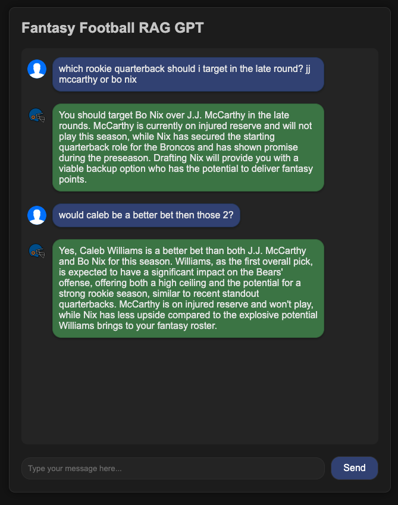
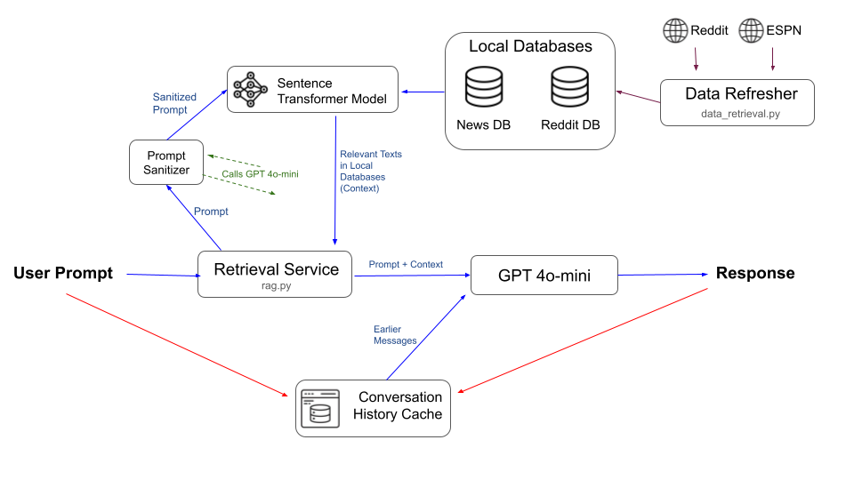

# Fantasy Football GPT Chat Bot Using Retrieval Augmented Generation
https://fantasy-rag-9f91dc013c3c.herokuapp.com/

## Summary
This repository runs a GPT-based chatbot that uses retrieval augmentation generation (RAG) to provide real time answers to fantasy football related questions. As of 08/25/24, we currently use GPT-4o-mini as the core GPT model in our RAG app. Below is an example of a conversation, note that it has real time injury data and analysis.

  

## Design

### Main Flow
1) **The user prompt is sent** to the retrieval service.
2) It first **sanitizes the prompt** to make it more searchable, by asking GPT to make it more clear (i.e. use player's full names instead of abbreivations, fix mispellings, and make the prompt concise.). Doing this makes the process more robust to user errors.
3) The sanitized prompt is sent to a **pretrained sentence transformer model**. In our app, the model is paraphrase-MiniLM-L3-v2, which is distilled version of MiniLM trained on sentence similarity and paraphrase identification tasks. We use a distilled model for inference speed.
4) The sentence transformer **model queries the News DB** for news relating to the query by computing sentence similarites between the sanitized prompt and news articles. We also do a generic News search for names of player in the query. **We take up to 5 most similar articles** to use as context into GPT.
5) The sentence transformer model also **queries the reddit DB** for all its post titles, and computes similarities between the sanitized prompt and titles, picking the top 20. We then get all the comments from all those 20 posts combined in the DB, and have the transformer model compute similarities between the sanitized prompt and all comments, picking the **top 20 most similar comments to also use as context into GPT**. This process is done efficiently with **vectorized code through the JAX library**.
6) We augment the original user prompt with the News context, Reddit comments context, **as well as conversation history**. We also add extra clarifications the prompt to make sure the GPT model knows what the current date is, to use injury information heavily, and to provide concise + opinionated responses.
7) We call the GPT API with the constructed prompt, and **return the response** to the user.

### Refreshing the Database
On Aug 25, 2024. The local Reddit and News databases were initialized with 30 days of information: The past 30 days of fantasy football-related news from ESPN, and past 30 days of reddit posts + comments from fantasy football related subreddits. Every day afterwards, the data refresher will:
1) Query the Reddit API for the last 24 hours of reddit posts + comments from fantasy football related subreddits
2) Query ESPN news articles for fantasy football related news in the past 24 hours.

Our RAG app queries this local databases, rather than calling the respective APIs when needed, to significantly lower the latency of the service. Although this results in more memory storage than needed, the latency improvement outweighs the cons of increased storage.

### Conversation History
Our main app service (main.py) will store user and bot responses in a given session in a conversation history cache, and feed it into the GPT call, to make sure that our application can coherently continue conversations.

## Instructions for Usage
To use this code, you need to setup and add your own API Keys to rag.py and data_retrieval.py. The website runs from a different private repo with valid API keys. This repo may be out of date with the repository used for running that website.
